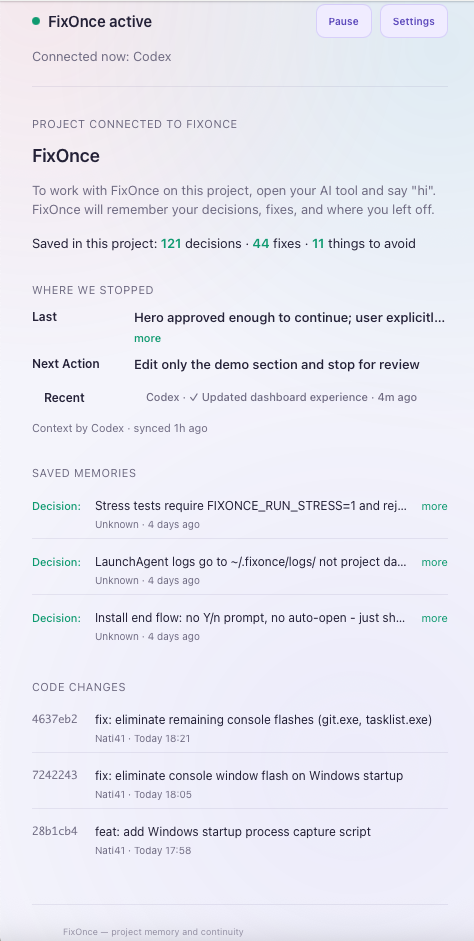

# FixOnce

**One developer. Multiple AI agents. One project memory.**

Project-owned memory for AI coding tools.

FixOnce is a local project memory layer for AI coding work. It keeps the project's decisions, solved fixes, avoid patterns, and next step with the repository so Claude, Codex, or Cursor can continue work without starting from zero.

AI conversations end. Projects continue. FixOnce exists to make project continuity independent of any single AI chat.

## The Problem

Without FixOnce:

- Every AI starts from its own context.
- Conversations end.
- Decisions disappear.

With FixOnce:

- The project remembers.
- AI agents can change.
- Work continues.

## Get Started

- Website: https://nati41.github.io/FixOnce/
- Releases: https://github.com/Nati41/FixOnce/releases
- Downloads: https://github.com/Nati41/FixOnce/releases
- Windows installer: https://github.com/Nati41/FixOnce/releases/download/v1.0.13/FixOnce_Setup_1.0.13.exe
- macOS installer: https://github.com/Nati41/FixOnce/releases/download/v1.0.13/FixOnce-mac.dmg

1. Download FixOnce from GitHub Releases.
2. Install it.
3. Open your project.
4. Open Claude, Codex, or Cursor.
5. Continue the project.

FixOnce restores the project state automatically before work continues.

## What FixOnce Does

FixOnce gives the active project a durable memory:

- Current goal and next step
- Decisions and their reasons
- Solved bugs and reusable fixes
- Avoid patterns and project constraints
- Recent handoff context for the next AI session

Every new AI session starts from the same project context instead of starting from zero.

The memory belongs to the project, not the model. A developer can move between supported AI coding tools while keeping one shared project context.

## Supported AI Coding Tools

Currently tested with:

- Claude
- Codex
- Cursor

Support depends on each coding agent's local integration capabilities.

## Desktop App

FixOnce runs as a desktop tray or menu-bar app. The app shows the connected project, active AI tool, current project state, saved decisions, solved fixes, and where work stopped.

It stays in the background while you work and provides project state when an AI tool needs it.

## Privacy And Control

FixOnce is designed around local, project-owned memory:

- FixOnce does not send your data to a FixOnce-operated cloud service.
- Connected AI tools may process context according to their own settings and policies.
- You can review, edit, or reject proposed memory before it is saved.
- Project memory may live with the repository through `.fixonce/` where enabled.

Legal and trust pages:

- Privacy: https://nati41.github.io/FixOnce/privacy.html
- Security: https://nati41.github.io/FixOnce/security.html
- Terms: https://nati41.github.io/FixOnce/terms.html

## For Developers

Developers interested in the implementation can explore the source code in `src/`, installer configuration in `installer/`, and tests in `tests/`.

For release builds and packaging notes, see `RELEASE.md`.

## Version

Current beta: `v1.0.13`
